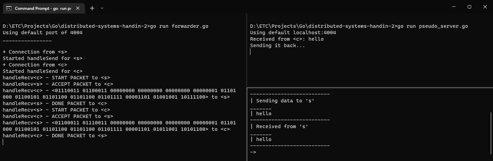
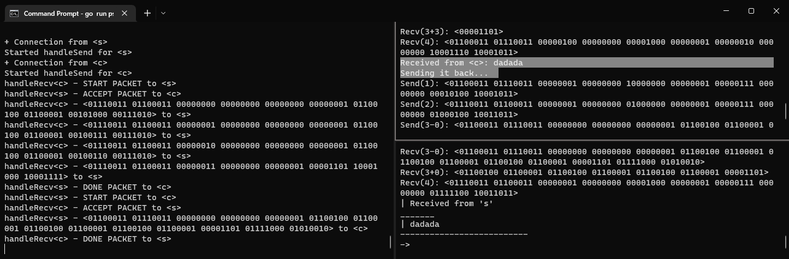

# a) What are packets in implementation . . .
I've recreated a simple TCP-inspired send & receive (on top of Golangs net-package) - that means, all of the communication happens in bytes.

As seen in `packet/packet.go`, this is how I've laid out a packet.
```go
// "packet" from pseudo-client/server
// | dest | src  | seq    | flags | padding | * size | data     | checksum |
// | 0x00 | 0x00 | 0x0000 | 00000 | 00...1  | 0x0000 | 0x...    | 0x0000   |
// | i8   | i8   | i16    | SAIFD | 3/11 b  | i16    | max size | i16      |
```
The full explanation of all the flags can be seen in abovementioned file, however the idea is that it uses flags to synchronize at what part of communication it is on.

`S(tart)` prompts `A(ccept)`, ending with `D(one)` once all data has been transferred. Based on the values in `seq` and `size` when `S(tart)`-packet is transmitted, the receiver knows how many packets are about to be sent (so when it has received that amount of packets with a valid checksum, it will respond with `D(one)`).

That does mean that unlike real TCP, based on parameters the wrapper-functions (`packet.Recv()` & `packet.Send()`) receives - it will not acknowledge *on* every packet (but it will still acknowledge the stream that they were a part of).

>
Image of communication (see forwarder output on the left), where every packet gets acknowledged and responded to by the other end

>
Image of communication (see forwarder output on the left), where it waits till stream of packets have come in to determine whether or not communication succeeded - ignore the noise in server (topright) & client (bottomright), verbose output is needed when splitting up data to several packets. See note way at bottom of README.md

# b) Does implementation use threads . . .
There are three separate processes needed to run my implementation, the `forwarder`, the `pseudo_server`, and the `pseudo_client`. The `forwarder` is the only one that differs from the others, since it has 2 goroutines running for each connection (a sender, and a receiver) - where as the pseudo_* only have a main-routine that they loop.

Threads are not realistic to use on a larger scale due to blocking when reading and writing - you can also only spawn so many threads before the OS it's running on starts complaining.

# c) Message reordering . . .
When the program is used as intended with a high `window`-parameter, then the state machine takes care of message reordering - neither client or server will send more than one packet without first getting a response
> There is one exception to this, that is if the server wants to send data after it is done receiving, in that case - you can imagine it sending a DONE-packet to client, and then a START-packet right after. If these two were to get switched, then the clients state machine will restart, since it was expecting a DONE-packet, not a start.

When used with a low `window`-parameter, my implementation takes advantage of the fact that we acknowledge the finished stream, not the individual packets - therefore, the data-packets can arrive in any order, as the seq-field will tell us in what order to combine them.

# d) How does it handle message loss . . .
If an expected packet never arrives - or the one that arrives has a different state, then it will simply discard all state and start anew. It does not support recovering part of state, nor prompt the other what packet is missing/wrong - it only tells it that it failed, so that the other party can start sending from start aswell.

# e) 3-way-handshake importance . . .
The 3-way-handshake is important since it's the building block for TCP-communication which allows for more trustworthy information exchange on unreliable networks - it does this by allowing server & client to synchronize their segment sequence numbers, meaning once a stream is established between them, either part of the exchange can notice if there is data missing.

e.g., if in the next packet received ACK is wildly out of sync with where other party expected it, then it can try to recover lost communication by replaying packets that were missed. Another important part, is that packets sent by TCP have checksums associated with them, that increase the likelihood of the packet being correct.
# Addendum
##  How to run
Inside of `pseudo_server.go` & `pseudo_client.go`, there are two example usages of my TCP-model - it is important that they match, so that if `pseudo_server.go` has been switched over to the pinging example, that `pseudo_client.go` also has.

 1. Comment out the example you wish to run in each file - or let it stay default.

 2. Run each of the files in separate terminals - the order of `forwarder.go` is important, it needs to be run first, the same is not true for `pseudo_client.go` and `pseudo_server.go`:

    ```console
    $ go run forwarder.go
    $ go run pseudo_server.go
    $ go run pseudo_client.go
    ```
## Changing network stability etc.
`forwarder.go` has all of the variables for changing network behaviour, these can be found at the top of the file:

    ```go
    // network has bad jitter
    var jitter bool = false

    // percentage for packet to be dropped, ignored
    var drop_packet int = 0

    // percentage for packet to have a bit flipped
    var flip_bit int = 0
    ```

>It is worth noting, that the effects of jitter wont be seen, unless the `window`-parameter in `packet.Send()` is less than the size of the data to be sent.
See line 49/50 in `pseudo_client.go`


**OBS.** with a low value of `window`-parameter - the chance of `packet.Recv()` & `packet.Send()` failing is very high UNLESS `verbose = true` in `packet.go`

Yes, I am aware that this is not ideal behaviour - but for some reason (maybe slowing it down?), it fails **measurably** less when it prints stuff... even though it has the exact same controlflow
